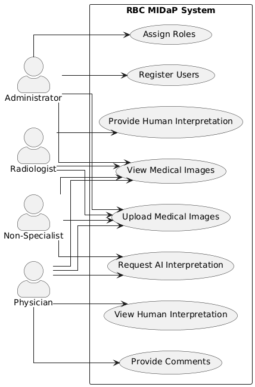

# RBC MIDaP System - Use Case Diagram and Flow of Events

## Use Case Diagram

## Brief Description

The RBC MIDaP (Medical Image Data Processing) system is designed to streamline the process of medical image management, interpretation, and collaboration among healthcare professionals. It incorporates both human expertise and artificial intelligence to improve diagnostic accuracy and efficiency.

Key features include:

- User management with role-based access control
- Medical image upload and viewing
- Human interpretation by radiologists
- AI-assisted interpretation
- Physician review and commenting system

The system caters to four main user roles: Administrators, Radiologists, Physicians, and Non-Specialists, each with specific permissions and responsibilities within the system.

## Detailed Flow of Events

### UC1: Register Users

1. Administrator logs into the system
2. Administrator selects "Register New User" option
3. System presents user registration form
4. Administrator enters new user's details (name, email, etc.)
5. Administrator selects the user's role
6. System validates the entered information
7. System creates the new user account in the database
8. System sends verification link to user's email account
9. On verification success, prompt the user to enter a new password and confirm password.
10. On error, display error message.

### UC2: Assign Roles

1. Administrator logs into the system
2. Administrator selects "Manage User Roles" option
3. System displays list of users
4. Administrator selects a user to modify
5. System shows current role and available role options
6. Administrator selects new role for the user
7. System updates the user's role
8. System confirms the role change

### UC3: Upload Medical Images

1. User logs into the system
2. User selects "Upload Medical Images" option
3. System presents upload interface
4. User selects image file(s) from their device
5. User adds metadata (e.g., patient ID, image type, date)
6. System validates file format and metadata
7. System stores the image(s) and metadata
8. System confirms successful upload to the user

### UC4: View Medical Images

1. User logs into the system
2. User selects "View Medical Images" option
3. System presents search/filter interface
4. User enters search criteria (e.g., patient ID, date range)
5. System retrieves and displays matching images
6. User selects an image to view in detail
7. System displays the full image with associated metadata

### UC5: Provide Human Interpretation

1. Radiologist logs into the system
2. Radiologist selects an image to interpret
3. System displays the image and interpretation interface
4. Radiologist examines the image
5. Radiologist enters their interpretation
6. Radiologist can annotate the image if needed
7. Radiologist submits the interpretation
8. System stores the interpretation with the image

### UC6: View Human Interpretation

1. Physician logs into the system
2. Physician selects an image to view
3. System displays the image
4. Physician requests to view human interpretation
5. System retrieves and displays the radiologist's interpretation
6. Physician reviews the interpretation
7. System logs the physician's access to the interpretation

### UC7: Request AI Interpretation

1. User (Physician or Non-Specialist) views a medical image
2. User selects "Request AI Interpretation" option
3. System confirms the request
4. System processes the image using AI algorithms
5. System generates an interpretation report
6. System notifies the user that the interpretation is ready
7. User views the AI-generated interpretation

### UC8: Provide Comments and Rate AI Interpretation

1. Physician logs into the system
2. Physician selects an image to view
3. System displays the image
4. Physician requests to view human interpretation (if available)
5. System retrieves and displays the radiologist's interpretation
6. Physician reviews the human interpretation
7. Physician requests to view AI interpretation
8. System retrieves and displays the AI-generated interpretation
9. Physician reviews the AI interpretation
10. System presents a rating interface for the AI interpretation
11. Physician rates the AI model's accuracy on a scale of 1-10
12. System records the accuracy rating
13. System presents comment input interface
14. Physician enters their comment on the image, human interpretation, and/or AI interpretation
15. Physician submits the comment and rating
16. System stores the comment and rating with the image and interpretations
17. System confirms the comment and rating have been added
18. System notifies relevant users (e.g., radiologist, AI team) of the new comment and rating
